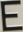
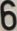
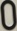

# ALPR

An automatic license plate recognition script for detecting single row Hungarian license plates using OpenCV.

## The steps of the process
In the following paragraphs I'm going to explain each step of the image processing and the preparation for the scripts to work.

### Preparation
Before we do anything we need a Python 3 environment with Numpy and OpenCV installed. I'm not going to explain how to do it, but here is the [official tutorial](https://docs.opencv.org/master/d5/de5/tutorial_py_setup_in_windows.html).

If we have the proper environment, we need template images for the recognition of the license plate characters.

For those i used an image, that can be seen in a [government decree](http://njt.hu/cgi_bin/njt_doc.cgi?docid=140326.418311), as Figure 10. found in the hungarian legislation. The image of the characters is shown below.

After we got the image, we need to split it up to individual characters. For that i created a python script called **fetch_chars**. This script works similar to the recognition script's character splitting, that will be explained later on.

After we run the script with the image from before, we get an image for each character. The character *'A'* looks like the following.

 

With these steps done, we have all we need to start recognizing license plates.

### Recognition
In this step we do the recognition with the **read_plate** script. This script can process multiple arguments, the most important of them is the **-input="..."** argument, because we give the path of the images to the script with it by inserting them between the quotes.

There is also the **-no-image** argument, which prevents the script from showing the process images at the end, and the **-silent** argument, which only outputs the found license plate numbers after recognition. An extra argument is the **-blur-limit=x** argument, i will explain about this in the blurring part of the recognition process.

In the next paragraphs I'm going to explain the image processing steps of the recognition.

#### Resizing
This step is just resizing the image to fit inside a box with the size of 1920x1080. Our image in the beginning looks like the image below.

#### Denoising
In this step, we get rid of the noise in the image, because image noise decreases the performance of the thresholding process later on.

The denoising is done with the following function.

    img_denoised = cv2.fastNlMeansDenoisingColored(img_start, None, 15, 10, 7, 21)
More about this function can be found [here](https://docs.opencv.org/master/d1/d79/group__photo__denoise.html#ga03aa4189fc3e31dafd638d90de335617).

After this step our image looks like the following.

#### Blurring
This step is similar to the previous step, it is also used to get rid of noise.
The blurring of the image is repeated until it reaches a specified blur interval. To do this, we need to get the blurriness of the image into a numeric value. For this the [following function](https://docs.opencv.org/master/d4/d86/group__imgproc__filter.html#gad78703e4c8fe703d479c1860d76429e6) is used.

    blur_value = cv2.Laplacian(img_blurred, cv2.CV_64F).var() * 100000 / (img.shape[0] * img.shape[1])

The blurring itself is done with [this function](https://docs.opencv.org/master/d4/d86/group__imgproc__filter.html#gaabe8c836e97159a9193fb0b11ac52cf1), which uses a 3x3 kernel

    img_blurred = cv2.GaussianBlur(img_denoised, (3, 3), 0)

The kernel:

    ⎡0  1  0⎤
    ⎢1 −4  1⎥
    ⎣0  1  0⎦

The limit of blurring can be set by the **-blur-limit=x** argument, where x is the limit in the form of a number.

The blurred image in our case looks similar, or the same as the denoised one, which can be seen below.

#### Edge detection
This step contains 3 smaller steps, to convert the image to a binary image of edges.

The first step is **grayscaling**. This converts the image to a grayscale image with the [following function](https://docs.opencv.org/master/d8/d01/group__imgproc__color__conversions.html#ga397ae87e1288a81d2363b61574eb8cab).

    img_grayscale = cv2.cvtColor(img_blurred, cv2.COLOR_BGR2GRAY)

The second step is determining the threshold value. This can be done with the [function below](https://docs.opencv.org/master/d7/d1b/group__imgproc__misc.html#gae8a4a146d1ca78c626a53577199e9c57).

    thr = cv2.threshold(img_grayscale, 0, 255, cv2.THRESH_BINARY | cv2.THRESH_OTSU)[0]

The last step is using the grayscale image and the threshold value, to perform a Canny edge detection on the image. This is done with the [following](https://docs.opencv.org/master/dd/d1a/group__imgproc__feature.html#ga04723e007ed888ddf11d9ba04e2232de).

    img_edges = cv2.Canny(img_grayscale, thr, 0.5 * thr)

After these steps our image looks like the one below.

#### Searching for plates
In this step, the script finds the possible plates, using operations on contours.

To filter the contours, first we need to find them. This can be done with the [following function](https://docs.opencv.org/master/d3/dc0/group__imgproc__shape.html#gadf1ad6a0b82947fa1fe3c3d497f260e0).

    cnt, hier = cv2.findContours(img_edges, cv2.RETR_LIST, cv2.CHAIN_APPROX_SIMPLE)

After we obtained the contour data of the images, we can start filtering them. The first filtration process is comparing the **size of the plate on the image** to the **size of the image**. If the ratio values are within the limits, they go to the next filtering step.

The next filtering is simple, the plate candidates are sorted by their size, and only the 50 biggest go to the next step. The areas are calculated with [this](https://docs.opencv.org/master/d3/dc0/group__imgproc__shape.html#ga2c759ed9f497d4a618048a2f56dc97f1) function.

After filtering by size, the next step is to count the contours inside the candidate. This is determined by the *is_inside* function seen below.

    def is_inside(inside, outside, limit_val=-1):
        point_limit = limit_val * len(inside)
        if limit_val < 0:
            point_limit = 1
        in_point = 0;
        for i in inside:
            is_in = cv2.pointPolygonTest(outside, tuple(i[0]), False)
            if is_in >= 0:
                in_point += 1
                if in_point >= point_limit:
                    return True
        return False

The `cv2.pointPolygonTest()` function determines if a point is inside a contour. More about the function [here](https://docs.opencv.org/master/d3/dc0/group__imgproc__shape.html#ga1a539e8db2135af2566103705d7a5722). The candidates that have a specific amount of contours in them pass the test. This amount is optimally the number of characters on the plate, but for better results 3 is used.

After the previous test, we filter the candidates by the ratio of their height and width. The **520/110** ratio is used for reference, because its the size of the plates we are looking for in mm. The amount of difference that is acceptable is defined by a precentage value.

The last step is similar to the step where the inside contours are counted, but instead of all the contours, the candidates are checked with each other using the *is_inside* function. This step mainly prevents the same area to be processed twice.

The image of the filtration is shown at the end, the colors describe the candidates that are thrown out at a specific step of the filtration. The **orange** contours are thrown out at the step, where the inside contours are counted, the **red** contours are thrown out at the ratio checking test, and the **turquoise** contours are thrown out if they are inside during the last step.

#### Detecting the numbers
Thanks to the previous filtration, the contours we have contain the license plate, and they are cut out from the resized original image. The plate in this state looks like this.

 

The plate then goes through the **same preparation** as the whole image, excluding the blurring steps. The preparation gives us a binary image of the license plate.

The **separation of the characters** is also the same as before, filtering the contours inside each other, and sorting them in size, but instead here only the 6 biggest are chosen. The 6 biggest contour area represents the 6 characters of the plate.

The characters are cut out and used in the next step. Their order is determinded by their horizontal position from left to right. They look like the following.

     

To convert the images of the characters into editable text, we need to compare them to the templates. To do this, each character is resized to the size of the template that it is compared to, and then converted to a binary image via the [grayscaling](https://docs.opencv.org/master/d8/d01/group__imgproc__color__conversions.html#ga397ae87e1288a81d2363b61574eb8cab) and [thresholding](https://docs.opencv.org/master/d7/d1b/group__imgproc__misc.html#ga72b913f352e4a1b1b397736707afcde3) method and a [function](https://docs.opencv.org/master/df/dfb/group__imgproc__object.html#ga586ebfb0a7fb604b35a23d85391329be) is used to give a matching value, these can be seen below in their respective order.

    # grayscaling
    t_gray = cv2.cvtColor(template, cv2.COLOR_BGR2GRAY)
    c_gray = cv2.cvtColor(c, cv2.COLOR_BGR2GRAY)

    # thresholding
    t_gray = cv2.adaptiveThreshold(
      t_gray,
      255,
      cv2.ADAPTIVE_THRESH_GAUSSIAN_C,
      cv2.THRESH_BINARY_INV,
      15,
      0)

    c_gray = cv2.adaptiveThreshold(
      c_gray,
      255,
      cv2.ADAPTIVE_THRESH_GAUSSIAN_C,
      cv2.THRESH_BINARY_INV,
      15,
      0)

    # matching
    vals.append([t, cv2.matchTemplate(t_gray, c_gray, cv2.TM_SQDIFF)[0][0]])

After we calculated the match value of each template, the one with the most score is chosen, thus defining the character on the plate. The characters put together form a license plate. At the end the detected plates are shown as follows.

The **console output** without the -silent argument looks like this:

    905    ms| Blur value: 9.01
    915    ms| Found 209 contours.
    1084   ms| 1 plates found.
    Plate 1 number: REK-609
    Executed in 1098 ms

### Testing
For testing the accuracy of the method, the **run_test** script is used. This compares the name of the images, which are the correct reads to the output of the **read_plate** script to the recognised plate numbers.

The result looks like this:

    NOZ-822 --- HOZ-822 Score: 5 Reads: 1
    PFC-808 --- PFG-008 Score: 5 Reads: 1
    NVW-388 --- NVW-300 Score: 4 Reads: 1
    NUX-659 --- NUX-659 Score: 6 Reads: 1
    PPE-525 --- PPE-525 Score: 6 Reads: 1
    Test done in 264.493 s
    Total: 95
    Correct: 41
    Multiple: 10
    Wrong: 44
    Average score: 4.315789473684211

Here we can see the processed plates, where the plate number before the "**---**" separation is the desired, after is the found. The score shows how many of the numbers on the plate are correctly read, and the reads show the amount of found plates on an image.

In my testing, I used 95 images, every one contained a single license plate. The **script correctly read 41** of them, **correctly read 10, but found plates that doesn't exist** and **failed in 44 instances**.

### Other

The source of the car images used in the example and testing is http://www.azauto.hu/2020/03/30/audi-q3-s-line-35-tfsi-aut/.

The test images can be found at https://www.dropbox.com/s/g0bamk0y9abkmxm/test_images.zip?dl=0.

The project was created by **Lengyel Márk (LNXQYO)** for an university class called **Gépi látás (GKNB_INTM038)**.
